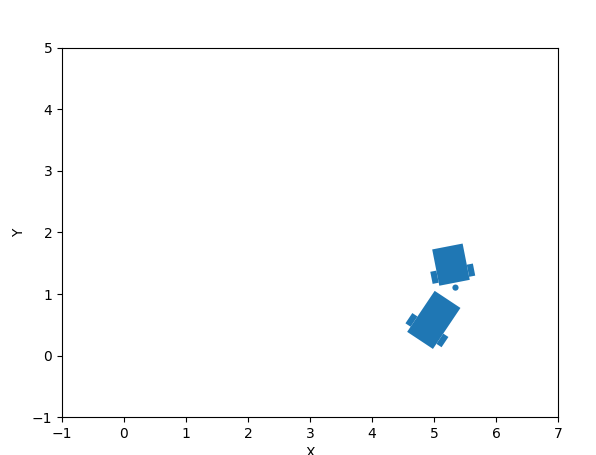

This package provide a simple framework for defining dynamic models, simulating with control inputs, and visualizing the simulation result in both graphs and animation.



## Enviroments
This module was tested with Python 3.9.

Install dependencies

```bash
pip install -r requirements.txt

```
## How to use this modules
1. Define dynamic models uses Model as base class
2. Using Animator, Simulator with the target model to simulate and animate the dynamics.

> I have written a tractor trailer model as an example, inside `models` folder.

## Simple run with TractorTrailerModel

```
python ./examples/main.py
```

